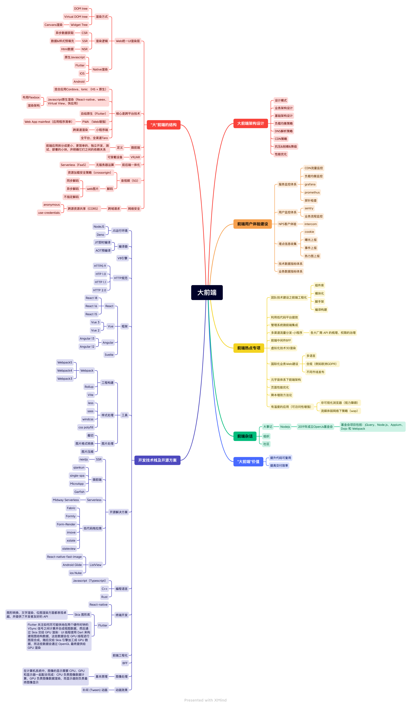
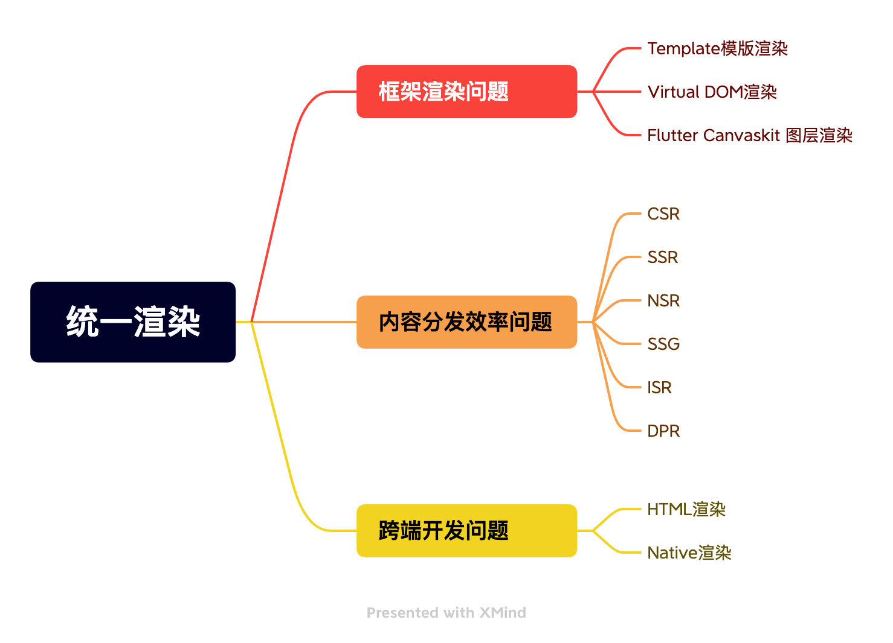
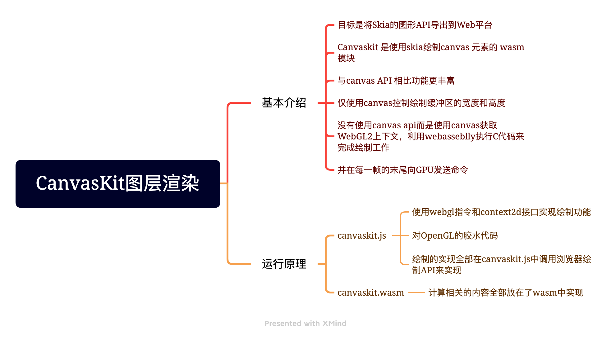
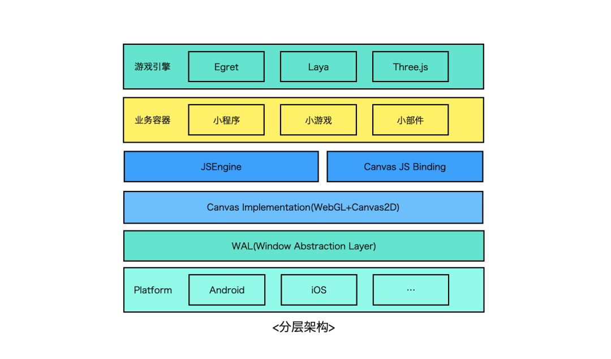
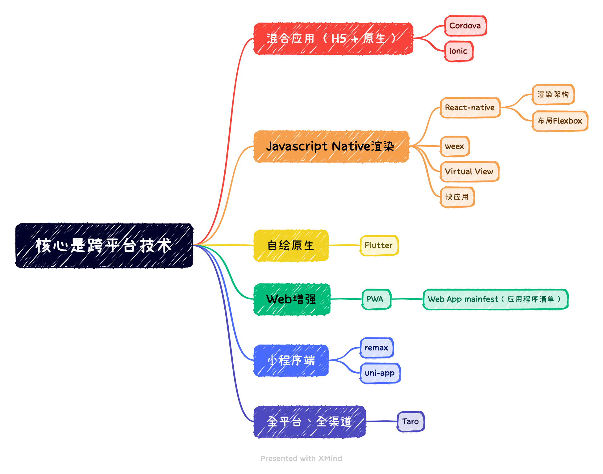
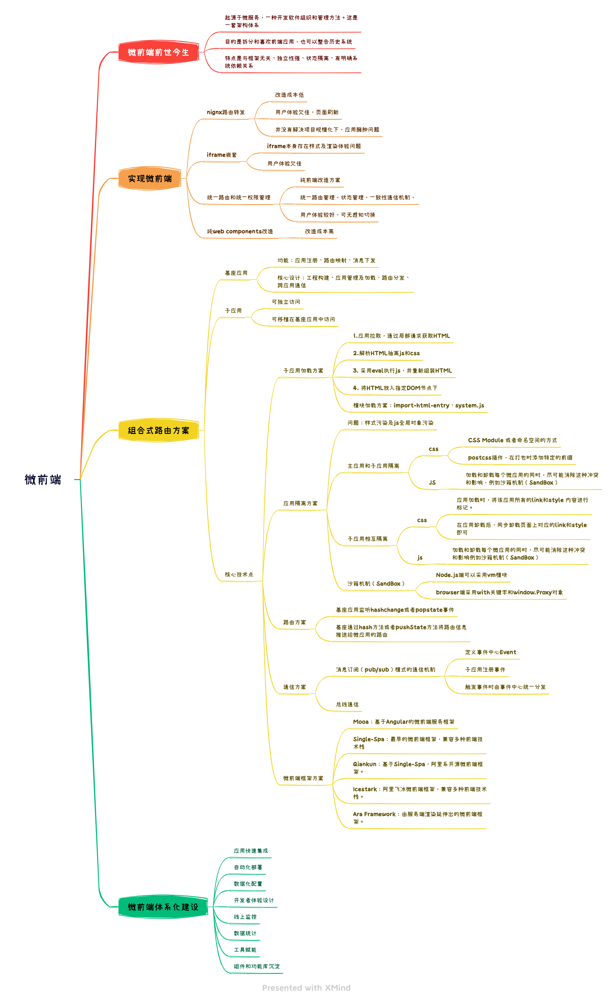

##  大前端知识体系

## 介绍



**目录**

一、"大前端"的结构

（1）Web统一UI渲染

（2）大前端核心是跨平台

二、微前端


### 一、"大前端"的结构

#### （1）Web统一UI渲染

Web端期望实现统一的UI渲染，通过复用web的标准、框架模式、工具，来降低开发门槛、扩宽使用场景、提升研发效率、降低维护成本。


统一UI层渲染问题分为如下三种：
- 框架渲染问题
  - 框架渲染与技术側的学习成本、开发者体验、工程效率息息相关。
  - 基于开发实践出现了Template模版渲染、Virtual DOM渲染、Flutter Canvaskit图层渲染
- 内容分发效率问题
  - 内容渲染时机与用户体验需要一个平衡点，这个平衡需要考虑生产效率、分发效率。
  - 例如SPA CSR兴起、SSR提升首屏体验、预渲染静态化、CDN内容动态化以及各大APP平台的NSR渲染
- 跨端开发问题
  - android、ios、desktop、Smart TV等跨端上web探索，第一类是基于webview的渲染，第二类是基于数据和UI的计算合成native渲染




渲染层具体技术介绍如下：
- [react-dom 虚拟DOM](https://github.com/facebook/react/tree/main/packages/react-dom!)
    - createPortal 提供了一种将子节点渲染到已 DOM 节点中的方式，该节点存在于 DOM 组件的层次结构之外
    - flushSync 强制 React 同步刷新提供的回调函数中的任何更新。这确保了 DOM 会被立即更新
    - hydrateRoot
    - renderToPipeableStream 将一个 React 元素渲染为初始 HTML。返回一个带有 pipe(res) 方法的流，用于管道输出。abort() 用于中止请求。完美支持了 suspense 和 HTML 流，“延迟” 的内容块会通过内联的 <script> 标签嵌入
    - renderToReadableStream 将一个 React 元素通过流的形式注入初始的 HTML 中
    - （静态页面生成器）renderToStaticNodeStream 此方法与 renderToNodeStream 相似，但此方法不会在 React 内部创建的额外 DOM 属性，例如 data-reactroot
    - renderToString 将一个 React 元素渲染成其初始的 HTML。React 将返回一个 HTML 字符串
    - （静态页面生成器）renderToStaticMarkup 与 renderToString 相似，只是该方法不会创建 React 内部使用的额外 DOM 属性，如 data-reactroot
```javascript
// 客户端
import { createRoot } from 'react-dom/client';
function App() { return <div>Hello World</div>; }
const root = createRoot(document.getElementById('root'));
root.render(<App />);

// 服务端
import { renderToPipeableStream } from 'react-dom/server';
function App() { return <div>Hello World</div>;}
function handleRequest(res) {
    const stream = renderToPipeableStream(<App />, {
        onShellReady() { res.statusCode = 200; res.setHeader('Content-type', 'text/html'); stream.pipe(res);},
    });
}
```
- [snabbdom virtual DOM库](https://github.com/snabbdom/snabbdom!)
    - 介绍：snabbdom以函数的形式来表达程序视图，但现有的解决方式基本都过于臃肿、性能不佳、功能缺乏、API 偏向于 OOP 或者缺少一些我所需要的功能
    - vue vdom基于snabdom实现
- [CanvasKit](https://skia.org/docs/user/modules/quickstart/！)



```html
<canvas id=foo width=300 height=300></canvas>

<script type="text/javascript"
  src="https://unpkg.com/canvaskit-wasm@0.19.0/bin/canvaskit.js"></script>
<script type="text/javascript">
  const ckLoaded = CanvasKitInit({
    locateFile: (file) => 'https://unpkg.com/canvaskit-wasm@0.19.0/bin/'+file});
  ckLoaded.then((CanvasKit) => {
    const surface = CanvasKit.MakeCanvasSurface('foo');

    const paint = new CanvasKit.Paint();
    paint.setColor(CanvasKit.Color4f(0.9, 0, 0, 1.0));
    paint.setStyle(CanvasKit.PaintStyle.Stroke);
    paint.setAntiAlias(true);
    const rr = CanvasKit.RRectXY(CanvasKit.LTRBRect(10, 60, 210, 260), 25, 15);

    function draw(canvas) {
      canvas.clear(CanvasKit.WHITE);
      canvas.drawRRect(rr, paint);
    }
    surface.drawOnce(draw);
  });
</script>
```

- 预编译 [handlebars 模版语法](https://github.com/handlebars-lang/handlebars.js)
  - 数据绑定包括：表达式 {{ data.name }} 、块表达式{{#custom}}、内置块表达式{{#with}} {{#each}} 等
    
- 预编译 [art-template 简约、超快的模板引擎](https://github.com/aui/art-template!)

- [ejs 高效的嵌入式 JavaScript 模板引擎](https://github.com/mde/ejs!)
  - EJS 能够缓存 JS 函数的中间代码，从而提升执行速度。例如：ejs.cache = LRU(100);
  - <% 流程控制、<%- 引入包含、<%= 数据写入
  
- [jsdom](https://github.com/jsdom/jsdom!)
  - 介绍：由 javascript 实现的一系列 web标准，特别是 WHATWG 组织制定的DOM和 HTML 标准，用于在 nodejs 中使用。该项目的目标是模拟足够的Web浏览器子集，以便用于测试和挖掘真实世界的Web应用

**优秀文档：**
- [Virtual DOM 的设计与实现](https://nosaid.com/article/virtual-dom!)
  - VNode 的设计
    - key 是 VNode 在同一父节点下的唯一标识
    - type 表示 tagName，表示节点的 tag 类型
    - data 是 IVNodeData 类型，包含了 节点属性、节点状态、事件 等信息
    - children 表示子节点数组，对应了真实 dom 中的 childNodes
    - text 表示 textContent
    - elm 对应了真实 dom 元素
    - isVNode 和 isSameVNode 是 VNode 相关的静态方法
  - VNode生成函数
  - diff 3种情况：
    - 对于相同的部分，保持不变。
    - 不一样，但是可复用。
      - 都是文本节点，内容更新
      - isSameVNode，tagName 和 key 都相同的时候，元素复用
      - 都是容器节点，递归比对children
        - 循环目标 children，能复用的节点，移动到当前位置，
        - 没找到能复用的节点，就自己生成一个
        - 多余删除
        - 非尾部插入，非尾部删除处理？？？？？？？？
    - 不一样，不能复用。
      - 新节点是容器节点，旧的是文本节点。删除文本，添加新节点
      - 新节点是文本节点，旧的是容器节点。删除容器节点，添加文本节点。
- [jsdom 中文介绍](https://github.com/jsdom/jsdom/wiki/jsdom-%E4%B8%AD%E6%96%87%E6%96%87%E6%A1%A3!)
- [跨平台Web Canvas渲染引擎架构的设计与思考(内含实现方案)](https://www.modb.pro/db/111446!)
  
- [你知道吗？SSR、SSG、ISR、DPR 有什么区别？](https://www.cnblogs.com/lhb25/p/16223782.html!)
- [CanvasKit简介](https://tedaliez.github.io/2019/07/14/CanvasKit%E7%AE%80%E4%BB%8B/!)

#### （2）大前端核心是跨平台

打破平台的桎梏，是前端开发人的执念。




整体发展阶段如下：

- Hybrid APP（类原生体验）
  - Cordova、Ionic
- Javascript Native APP （原生体验）
  - React-native、Weex
- Flutter Native APP （原生体验）
  - Flutter
- Progressive Web APP （类原生体验）
  - PWA无需下载、快速启动、顺滑体验，提供可靠的、快速的、沉浸式的应用。
- 小程序 APP（类原生体验）
    - weixin 、 douyin、alipay、baidu等
    - 跨渠道的框架Taro、uni-app、mpvue、remax

Hybrid APP 分析


Js-bridge设计


#### 二、微前端

微服务是一种开发软件的架构和组织方法，其中软件由通过明确定义的API进行通信的小型独立服务组成。把微服务的概念应用到前端， 前端微服务/微前端服务 就诞生了，简称其为微前端。

微前端框架一般具有以下三个特点：

- 技术栈无关：主框架不限制接入应用的技术栈，子应用具备完全自主权。
- 独立性强：独立开发、独立部署，子应用仓库独立。
- 增量升级
- 状态隔离：运行时每个子应用之间状态隔离。



微前端实现思路：
- 服务端集成，利用Nginx配置反向代理来实现不同路径映射到不同应用
- 运行时集成，使用 iframe ，通过配置不同的src加载不同的子应用页面
- 现有开源方案
  - Single-Spa：最早的微前端框架，兼容多种前端技术栈
    - 核心定义了一套协议，协议包含主应用的配置信息和子应用的生命周期，通过协议主应用可以知道在什么情况下激活哪个子应用。
```javascript
singleSpa.registerApplication({
  name: "subApp1", //子应用的名称
  app: () => System.import("/a/b/subAPP/code"),//告诉主应用如何加载子应用的代码，
  activeWhen: "/subApp1", //告诉主应用何时激活子应用
});
```
  - Qiankun：基于Single-Spa，阿里系开源微前端框架。
  - Icestark：阿里飞冰微前端框架，兼容多种前端技术栈。
  - Mooa：基于Angular的微前端服务框架
  - Ara Framework：由服务端渲染延伸出的微前端框架。
  - Webpack 5 Module Federation（模块联邦实现代码共享）
    - 目的：一个单体应用拆分成多个独立构建，独立开发、独立部署的子模块
    - 话术：本地模块和远程模块。本地模块即普通模块，是当前构建的一部分。远程模块不属于当前构建，并在运行时从所谓的容器中加载。
    - 容器如何加载远程模块？即 chunk 异步加载操作，import()或者require.ensure 或 require([...])
    - 容器加载如何并暴露访问？加载模块（异步的）并执行模块（同步的），容器可嵌套，循环引用
    - 共享模块：既可重写的又可作为向嵌套容器提供重写的模块。可理解为每个构建中的相同模块，例如相同的库
    - 模块版本问题：packageName 选项允许通过设置包名来查找所需的版本。默认情况下，它会自动推断模块请求，当想禁用自动推断时，请将 requiredVersion 设置为 false 。

优秀文档：
- [Webpack5 跨应用代码共享 - Module Federation](https://segmentfault.com/a/1190000024449390!)


#### 三、前端工程化

**什么是前端工程化？**

前端工程是软件工程子类，是将软件工程的方法和原理运用在前端开发中, 目的是实现高效开发，有效协同，质量可控。
落地至技术层面是持续优化，从开发阶段的代码转变成生产环境的代码的一系列步骤。主要包括构建，分支管理, 自动化测试, 部署等。

主要看两个路径：

- 技术演化：傻瓜化 -> 模版化 -> 流程化 -> 自动化 -> 智能化
- 视角转化：工程 -> 项目 -> 团队 -> 平台 -> 开放&开源

当技术演化至流程化，需要依赖场景并结合效率、规范、安全，打造团队甚至平台级的效率工程产品。
这个过程是需要平衡的，从团队规模和业务规模上去理解，优先解决效率瓶颈、资源瓶颈，技术债务是可以后面补偿的。


**工程化手段**

- 前后端分离
  - 前后端职责不清、沟通存在障碍、信息不透明在前端发展早期是管理问题，而今是主要是技术问题。
  - 需要以代码库分离、部署分离为基础，前端保证渲染和用户交互，后端保证数据及服务稳定。
  - 在协作层面，并行开发是基本要求。做到数据逻辑收敛、交互逻辑收敛。
  - 那技术上到底如何厘清业务逻辑？是前端还是后端。在协作上怎样补充，需要对齐这个约定。
- 基础建设
  - 模版化
    - 开发模版，填充具体逻辑。（例如IDE设置代码模版）
    - 示例代码，仿照创建新功能。（例如状态管理的reducer示例、部署脚本、nginx脚本、docker脚本）
  - 工具化
    - 大部分模版化模块可以通过工具，一键式生成。甚至通过文件系统监听，自动化生成。
    - 开发过程CV操作是低效且不可靠的，因此脚手架、自定义命令，可以保证安全和一致性
    - 很多技术手段是分散的，图片预处理压缩（如果项目没集成）、lighthouse跑分，可统一集成
  - 套餐化
    - 移动端、PC端、大屏
    - 框架层react、vue、angular
    - ts、postcss、tailwind、babel、editor、lint、gitignore、prettier、husky、ci/cd yml、browserslist等配置
    - 根据业务场景定制，例如数据可视化、用户拖拽可编辑、纯展示类等
  - Mock化
    - 后台接口数据
    - APP接口数据
    - 本地化数据
    - 流程依赖数据
  - 组件化
    - 基础UI组件库
    - 业务组件库
    - 可视化组件库
    - 动效组件库
    - 字体库
    - 编辑器组件库（文本、流程图、脑图等）
  - CI/CD
    - CI 持续集成，包括代码提交、检查、构建、测试
    - CD 持续部署，包括镜像或者软件包管理、部署、服务实例验证、应用监控、质量和性能预警反馈
  - 服务设施
    - sonar 、sentry、grafana、prometheus、k8s、dynamic polyfill、Mobile Test、sentry、gitlab
- 代码治理
- 应用监控
- 工程能力升级


#### 四、BFF
#### 五、2D 图形渲染

**CPU vs GPU**

CPU 和 GPU 都属于处理单元，但是结构不同。

CPU 处理任务管道化，处理任务的速度完全取决于处理单个任务的时间，所以处理单个任务的能力十分的强大。

GPU 是由大量的小型处理单元构成的，一幅图像是由成千上万的像素点组成，每次处理一个像素都是一个简单任务，GPU能够保证同时处理所有的像素点。

- WebGL
  - WebGL通过引入一个与 OpenGL ES 2.0 非常一致的 API 来做到这一点，该 API 可以在 HTML5 <canvas>元素中使用。 这种一致性使 API 可以利用用户设备提供的硬件图形加速。
  - Data in WebGL， GLSL 为 Shader 提供了三种不同作用的数据存储，每种都有一个特定的用例
- WebGL 2 
  - 是 WebGL 的一个主要更新，它通过WebGL2RenderingContext 接口提供。
  - 它基于 OpenGL ES 3.0，新功能包括
- canvas 
  - Canvas API 用于在网页上进行 2D 图形处理。

**WebGL渲染管线**

渲染管线是显示芯片内部处理图形信号相互独立的并行处理单元，主要分为以下几步：

- 顶点着色器处理顶点 （对传入GPU中的顶点信息进行处理，需要进行裁剪空间变换、平移、缩放、旋转等操作。这些操作都是对顶点进行的，它直接改变了顶点的位置。 ）
- 图元装配
- 光栅化
- 片元着色器着色
- 测试 & 混合

**着色器（Shader）**

着色器是一种计算程序，主要用于进行图形处理。分为如下几类：
- 顶点着色器（Vertex Shader）
- 片元着色器(Fragment Shader)
- 存储限定符
  - attribute: 只能出现在顶点着色器中，表示每个顶点的数据。在光栅化过程中会对attribute变量进行插值处理。可以从外部往WebGL内部中传递数据
  - uniform: 可以出现在顶点着色器和片元着色器中，表示统一的值，每个顶点/片元使用的这个值都是一样的。
  - varying: 可以出现在顶点着色器和片元着色器中，表示变化的值，在光栅化阶段，GPU将attribute变量插值处理后的结果赋给了varying变量，它是链接顶点着色器和片元着色器变量之间的桥梁。

**数据传递**

- 传递Attribute变量 （传递attribute变量的数据需要使用 WebGLBuffer这个WebGL内置的数据结构）
- 传递Uniform变量
  - 通过API获取uniform变量在WebGL程序中的地址(gl.getUniformLocation)
  - 再通过API这个地址中填充数据即可（gl.uniform1f， gl.uniform1i, gl.uniform2f......）
- 传递纹理
  - 创建纹理对象（WebGLTexture）(gl.createTexture())
  - 绑定纹理对象(gl.bindTexture)
  - 设置纹理参数
  - 传入纹理（gl.texImage2D）


图片加载方式，一种是线性加载，而另一种则是渐进式加载。

什么决定了图片的加载方式呢？图片的压缩算法。
- 线性加载是离散余弦变化算法
- jpeg渐进式图片加载

选择合适的图片格式
- JPEG(有损压缩) 适用于呈现色彩丰富的图片
  - 以 24 位存储单个图，可以呈现多达 1600 万种颜色
  - 把图片体积压缩至原有体积的 50% 以下时，JPG 仍然可以保持住 60% 的品质
  - 处理矢量图形和 Logo 等线条感较强、颜色对比强烈的图像时，人为压缩的图片模糊会相当明显
  - 不支持透明度处理
  - 三种格式标准JPEG格式、渐进式JPEG格式、JPEG2000
  - 四种压缩
    - 基于DCT的顺序编码 线性
    - 基于DCT的累进编码 渐进式
    - 基于DCT的分层编码 渐进式
    - 基于空间DPCM的无损压缩
- PNG 可移植网络图形格式是由 W3C 开发的图片格式 (无损压缩的高保真的图片格式)
  - 同时支持 8 位 (256 种颜色)和 24 位(1600 万种颜色)
  - 对线条的处理更加细腻，对透明度有良好的支持
  - 支持透明度处理，透明图片可选择使用 PNG
  - LZ77派生算法压缩比率更高
  - 主要用它来呈现小的 Logo、颜色简单且对比强烈的图片或背景等。
- GIF 是一种最多支持 256 种颜色的 8 位无损图片格式
  - 支持动画，适合去展示一些无限循环的动画
  - 对于一些只有简单色彩的图片非常合适
  - 采用LZW（串表）压缩算法进行编码
- BMP
  - 图像信息丰富
  - 不进行压缩占用空间大

- WebP
  - 同时提供了有损压缩与无损压缩
  - 可以显示动态图片
  - 支持透明
  - 移动端 IOS 系统基本不支持

点阵图和矢量图，区别在于缩放会失真


优秀文档：
- [CPU versus GPU with the Canvas Web API](https://www.middle-engine.com/blog/posts/2020/08/21/cpu-versus-gpu-with-the-canvas-web-api!)
  - 介绍：CanvasAPI是一个丰富和性能强的API，用于在Web浏览器中绘制和操作2D图形。它与<canvas>HTML元素或OffscreenCanvas一起使用。当将内容渲染到canvas时，浏览器可以选择使用CPU或GPU。这篇文章着眼于浏览器是如何做出这一决定的，以及这对性能的影响。
  - 浏览器策略
    - 当创建Canvas时，浏览器需要考虑如何存储。它可能在主内存中存储数据，调用cpu上运行方法去渲染，也可能在GPU创建canvas，调用GPU指令绘制它。

[渲染页面：浏览器的工作原理](https://developer.mozilla.org/zh-CN/docs/Web/Performance/How_browsers_work!)


