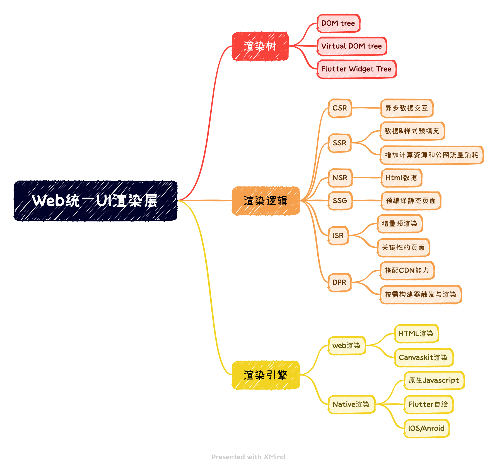
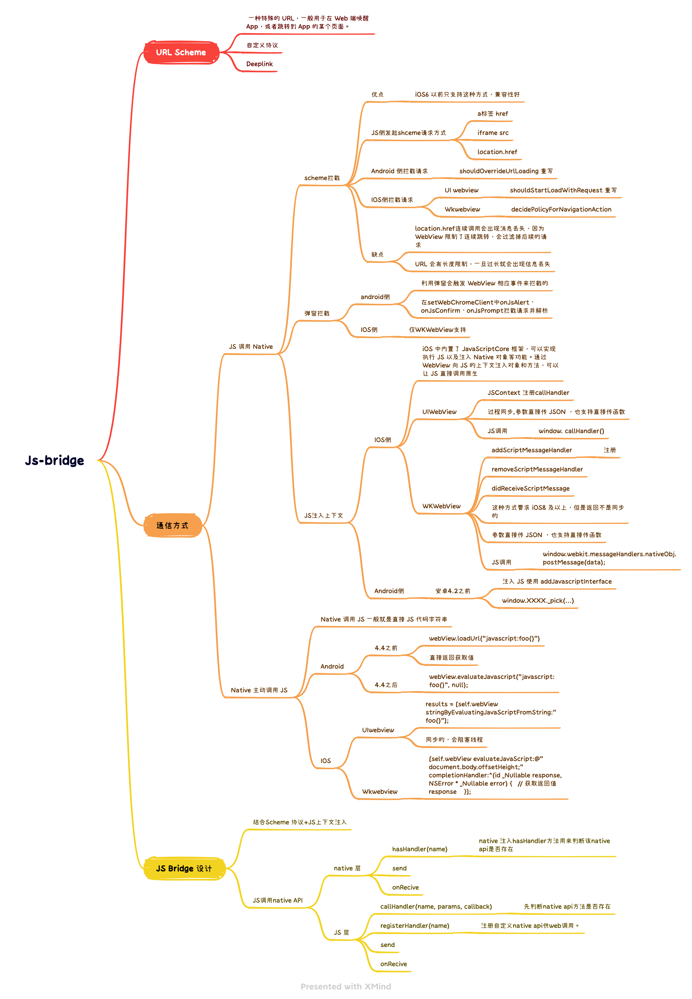

##  大前端知识体系

## 介绍


**目录**

一、"大前端"的结构
（1）Web统一UI渲染
（2）大前端核心是跨平台
二、微前端


### 一、"大前端"的结构

#### （1）Web统一UI渲染

Web端期望实现统一的UI渲染，通过复用web的标准、框架模式、工具，来降低开发门槛、扩宽使用场景、提升研发效率、降低维护成本。




统一UI层渲染问题分为如下三种：
- 框架渲染问题
  - 框架渲染与技术側的学习成本、开发者体验、工程效率息息相关。
  - 基于开发实践出现了Template模版渲染、Virtual DOM渲染、Flutter Canvaskit图层渲染
- 内容分发效率问题
  - 内容渲染时机与用户体验需要一个平衡点，这个平衡需要考虑生产效率、分发效率。
  - 例如SPA CSR兴起、SSR提升首屏体验、预渲染静态化、CDN内容动态化以及各大APP平台的NSR渲染
- 跨端开发问题
  - android、ios、desktop、Smart TV等跨端上web探索，第一类是基于webview的渲染，第二类是基于数据和UI的计算合成native渲染


渲染层具体技术介绍如下：
- [react-dom 虚拟DOM](https://github.com/facebook/react/tree/main/packages/react-dom!)
    - createPortal 提供了一种将子节点渲染到已 DOM 节点中的方式，该节点存在于 DOM 组件的层次结构之外
    - flushSync 强制 React 同步刷新提供的回调函数中的任何更新。这确保了 DOM 会被立即更新
    - hydrateRoot
    - renderToPipeableStream 将一个 React 元素渲染为初始 HTML。返回一个带有 pipe(res) 方法的流，用于管道输出。abort() 用于中止请求。完美支持了 suspense 和 HTML 流，“延迟” 的内容块会通过内联的 <script> 标签嵌入
    - renderToReadableStream 将一个 React 元素通过流的形式注入初始的 HTML 中
    - （静态页面生成器）renderToStaticNodeStream 此方法与 renderToNodeStream 相似，但此方法不会在 React 内部创建的额外 DOM 属性，例如 data-reactroot
    - renderToString 将一个 React 元素渲染成其初始的 HTML。React 将返回一个 HTML 字符串
    - （静态页面生成器）renderToStaticMarkup 与 renderToString 相似，只是该方法不会创建 React 内部使用的额外 DOM 属性，如 data-reactroot
```javascript
// 客户端
import { createRoot } from 'react-dom/client';
function App() { return <div>Hello World</div>; }
const root = createRoot(document.getElementById('root'));
root.render(<App />);

// 服务端
import { renderToPipeableStream } from 'react-dom/server';
function App() { return <div>Hello World</div>;}
function handleRequest(res) {
    const stream = renderToPipeableStream(<App />, {
        onShellReady() { res.statusCode = 200; res.setHeader('Content-type', 'text/html'); stream.pipe(res);},
    });
}
```
- [snabbdom virtual DOM库](https://github.com/snabbdom/snabbdom!)
    - 介绍：snabbdom以函数的形式来表达程序视图，但现有的解决方式基本都过于臃肿、性能不佳、功能缺乏、API 偏向于 OOP 或者缺少一些我所需要的功能
    - vue vdom基于snabdom实现
- [CanvasKit](https://tedaliez.github.io/2019/07/14/CanvasKit%E7%AE%80%E4%BB%8B/!)
  - Flutter 将引擎编译成 WebAssembly 格式，并使用 WebGL 渲染，这种渲染方式的渲染器官方称为 CanvasKit 渲染器

- 预编译 [handlebars 模版语法](https://github.com/handlebars-lang/handlebars.js)
  - 数据绑定包括：表达式 {{ data.name }} 、块表达式{{#custom}}、内置块表达式{{#with}} {{#each}} 等
    
- 预编译 [art-template 简约、超快的模板引擎](https://github.com/aui/art-template!)

- [ejs 高效的嵌入式 JavaScript 模板引擎](https://github.com/mde/ejs!)
  - EJS 能够缓存 JS 函数的中间代码，从而提升执行速度。例如：ejs.cache = LRU(100);
  - <% 流程控制、<%- 引入包含、<%= 数据写入
  
- [jsdom](https://github.com/jsdom/jsdom!)
  - 介绍：由 javascript 实现的一系列 web标准，特别是 WHATWG 组织制定的DOM和 HTML 标准，用于在 nodejs 中使用。该项目的目标是模拟足够的Web浏览器子集，以便用于测试和挖掘真实世界的Web应用

**优秀文档：**
- [Virtual DOM 的设计与实现](https://nosaid.com/article/virtual-dom!)
  - VNode 的设计
    - key 是 VNode 在同一父节点下的唯一标识
    - type 表示 tagName，表示节点的 tag 类型
    - data 是 IVNodeData 类型，包含了 节点属性、节点状态、事件 等信息
    - children 表示子节点数组，对应了真实 dom 中的 childNodes
    - text 表示 textContent
    - elm 对应了真实 dom 元素
    - isVNode 和 isSameVNode 是 VNode 相关的静态方法
  - VNode生成函数
  - diff 3种情况：
    - 对于相同的部分，保持不变。
    - 不一样，但是可复用。
      - 都是文本节点，内容更新
      - isSameVNode，tagName 和 key 都相同的时候，元素复用
      - 都是容器节点，递归比对children
        - 循环目标 children，能复用的节点，移动到当前位置，
        - 没找到能复用的节点，就自己生成一个
        - 多余删除
        - 非尾部插入，非尾部删除处理？？？？？？？？
    - 不一样，不能复用。
      - 新节点是容器节点，旧的是文本节点。删除文本，添加新节点
      - 新节点是文本节点，旧的是容器节点。删除容器节点，添加文本节点。
- [jsdom 中文介绍](https://github.com/jsdom/jsdom/wiki/jsdom-%E4%B8%AD%E6%96%87%E6%96%87%E6%A1%A3!)
- [跨平台Web Canvas渲染引擎架构的设计与思考(内含实现方案)](https://www.modb.pro/db/111446!)
  
- [你知道吗？SSR、SSG、ISR、DPR 有什么区别？](https://www.cnblogs.com/lhb25/p/16223782.html!)

#### （2）大前端核心是跨平台

打破平台的桎梏，是前端开发人的执念。


整体发展阶段如下：

- Hybrid APP（类原生体验）
  - Cordova、Ionic
- Javascript Native APP （原生体验）
  - React-native、Weex
- Flutter Native APP （原生体验）
  - Flutter
- Progressive Web APP （类原生体验）
  - PWA无需下载、快速启动、顺滑体验，提供可靠的、快速的、沉浸式的应用。
- 小程序 APP（类原生体验）
    - weixin 、 douyin、alipay、baidu等
    - 跨渠道的框架Taro、uni-app、mpvue、remax

Hybrid APP 分析


Js-bridge设计



#### 二、微前端
微服务是一种开发软件的架构和组织方法，其中软件由通过明确定义的API进行通信的小型独立服务组成。把微服务的概念应用到前端， 前端微服务/微前端服务 就诞生了，简称其为微前端。

微前端框架一般具有以下三个特点：

- 技术栈无关：主框架不限制接入应用的技术栈，子应用具备完全自主权。
- 独立性强：独立开发、独立部署，子应用仓库独立。
- 状态隔离：运行时每个子应用之间状态隔离。


微前端实现思路：
- 服务端集成，利用Nginx配置反向代理来实现不同路径映射到不同应用
- 运行时集成，使用 iframe ，通过配置不同的src加载不同的子应用页面
- 现有开源方案
  - single-spa
    - 核心定义了一套协议，协议包含主应用的配置信息和子应用的生命周期，通过协议主应用可以知道在什么情况下激活哪个子应用。
```javascript
singleSpa.registerApplication({
  name: "subApp1", //子应用的名称
  app: () => System.import("/a/b/subAPP/code"),//告诉主应用如何加载子应用的代码，
  activeWhen: "/subApp1", //告诉主应用何时激活子应用
});
```
  - qiankun
  - 
  - Module Federation


